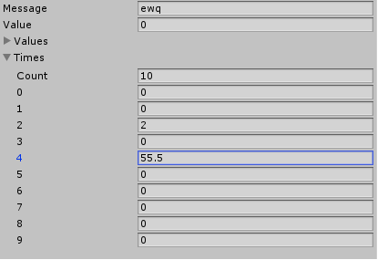

ver:2.0

### TypeDrawer What is it?

It is a type drawing system, similar to Unity's SerializedObject, but it supports any type

### 如何使用它?

Using it is as simple as Unity's SerializedObject.

```

class Test
{
	string Message;
	int Value;
	int[] Values;
	List<float> Times;
}

Test _test = new Test();

TypeDrawObject drawObject = new TypeDrawObject(_test);;

TypeDraw.DrawType("",drawObject);

```

