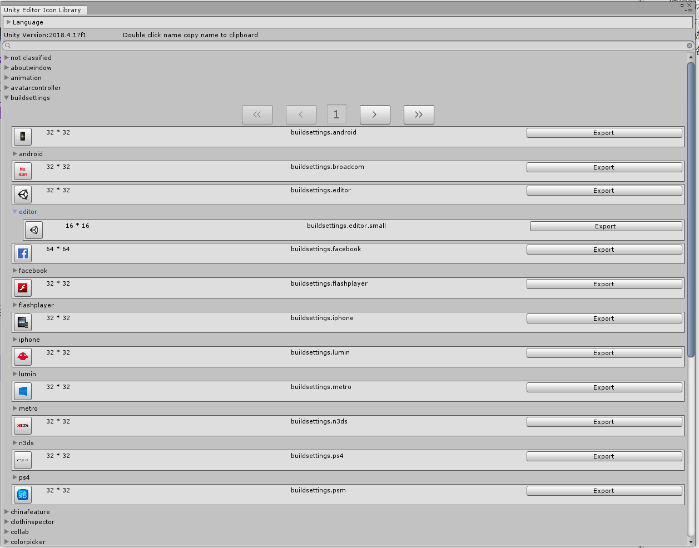

### What is it?

When developing an editor, we can't always know the name of Unity's built-in Icon. I always before writing it check the `Unity Icon`. but because many icons are slow to load, and the version update is slower. but it followsYou have the unity version, so you don't need to worry about different versions that cause the icon name to change or not exist.

### Its function

1.Multi-level classification and paging management of icons

2.Search icon

3.Copy the icon name, double-click the icon name to copy

4.Export icon

