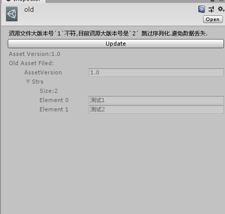
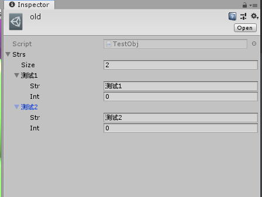

1. ##### `InitializeOnRun`特性
> 该特性类似Unity的`InitializeOnLoad`,但是该特性是带优先级的,不过他的本质也是在`InitializeOnLoad`实现,不过会出现一个问题就是当你修改代码触发了`InitializeOnLoad`后,`InitializeOnRun`标记的类如果调用了Unity相关的API,你可能会看到类似的错误`UnityException: xxxxAPI is not allowed to be called from a ScriptableObject constructor (or instance field initializer), call it in OnEnable instead. Called from ScriptableObject 'AnimationRuntimeExecuteEventRegisteredEditorModule'. 'xxxxxxx'`如果遇到这样的错误,请吧这部分代码放入EditorApplication.update.
2. YAMLObject的使用
- 说明:如果你需要对Yaml进行一些手动处理,那这个类你会很常用,我是用来做数据保护的,因为`ScriptableObject`如果因为版本变动了,如果不做数据保护或处理的话,那老数据会丢失.
- 使用方式:使用起来很简单,只需`UnityYAMLObject _unityYamlObj = new UnityYAMLObject("Yaml文件路径")`,我同时提供了一个`YAMLObjectEditor`它有一个`DrawYaml`函数,可以将YAML绘制出来
- 一个简单数据保护的例子:
```
//1.0版本
{
	[CreateAssetMenu()]
	public class TestObj:ScriptableObject
	{
		public const string ScriptVersion = "1.0";
		[HideInInspector]
		public string AssetVersion = "1.0";

		public List<string> Strs;
	}
}

//2.0版本,List<string> 变为了 List<TestC>
{
	[Serializable]
	public struct TestC
	{
		public string Str;

		public int Int;
	}
	
	[CreateAssetMenu()]
	public class TestObj:ScriptableObject
	{
		public const string ScriptVersion = "2.0";

		[HideInInspector]
		public string AssetVersion = "2.0";

		public List<TestC> Strs;
	}
}
	
[CustomEditor(typeof(TestObj))]
public class customEditorTestObj : YAMLObjectEditor
{
	private SerializedProperty script;
	private TestObj _tt;

	private string _scriptBigVersion;
	private string _assetBigVersion;
	private string _assetPath;
	private UnityYAMLObject _unityYamlObj;

	void OnEnable()
	{
		_tt = (TestObj) target;
		_getBigVersion();
		_assetPath = AssetDatabase.GetAssetPath(target);
		_unityYamlObj = new UnityYAMLObject(_assetPath);
	}

	private void _getBigVersion()
	{
		_scriptBigVersion = _getBigVersion(TestObj.ScriptVersion);
		_assetBigVersion = _getBigVersion(_tt.AssetVersion);
	}

	private string _getBigVersion(string version)
	{
		return version.Split('.')[0];
	}
	
	 public override void OnInspectorGUI()
        {
            if (_scriptBigVersion != _assetBigVersion)
            {
                serializedObject.Update();

                EditorGUILayout.LabelField(
                    $"资源文件大版本号`{_assetBigVersion}`不符,目前资源大版本号是`{_scriptBigVersion}` 跳过序列化.避免数据丢失.");

				//升级按钮,将版本从1.0升级为2.0
                if (GUILayout.Button("Update"))
                {
                    //获取1.0的 Strs 数据
                    YamlSequenceNode aa = (YamlSequenceNode) _unityYamlObj.GetNode("Strs");

                    _tt.Strs = new List<TestC>();
					
					//进行数据升级
                    foreach (var yamlNode in aa.Children)
                    {
                        _tt.aa.Add(new TestC() {Str = yamlNode.ToString()});
                    }

					//更新版本为2.0
                    _tt.AssetVersion = "2.0";

                    Debug.Log("Update Complete.");

                    serializedObject.ApplyModifiedProperties();
					
					//刷新大版本号
                    _getBigVersion();
					
                    EditorUtility.SetDirty(target);
                    AssetDatabase.SaveAssets();
                    AssetDatabase.Refresh();
                }

				//将YAML 绘制出来
                GUI.enabled = false;
                {
                    EditorGUILayout.LabelField($"Asset Version:{_tt.AssetVersion}");

                    EditorGUILayout.LabelField("Old Asset Filed:");

                    EditorGUI.indentLevel++;
                    {
                        bool show = false;
                        int index = 0;
                        foreach (var node in _unityYamlObj.Root.Children)
                        {
                            if (node.Key.ToString() == "AssetVersion")
                            {
                                show = true;
                            }

                            EditorGUI.indentLevel++;
                            {
                                if (show)
                                {
                                    DrawYaml(node.Key.ToString(), node.Value);
                                }
                            }
                            EditorGUI.indentLevel--;

                            index++;
                        }
                    }
                    EditorGUI.indentLevel--;
                }
                GUI.enabled = true;

                return;
            }

            this.DrawDefaultInspector();
        }
}
```
例子效果:






3. AnimationEventUtil的使用,注意以下API操作都没有Undo
- 这个类主要是Animation Event的增,删,查的扩展方法,扩展类为`AnimationClip`,`ModelImporter`
- AnimationClip API:
> 1. GetEves(List<AnimationEvent>) : 获取动画全部事件,填充的数据的List
> 2. AddEve(AnimationEvent) : 添加事件
> 3. AddEves(IEnumerable<AnimationEvent>) : 添加一组事件
> 4. RemoveEve(int) : 删除事件,参数是事件的索引
> 5. RemoveAllEve() : 删除所有的事件
- ModelImporter API:
> 1. GetAnimationClipEvents(AnimationClip, List<AnimationEvent>) : 获取给定的AnimationClip的所有动画事件,List为填充的数据
> 2. GetAnimationClipEvents(string, List<AnimationEvent>) : 获取给定名字的动画的所有动画事件,List为填充的数据
> 3. GetModelAnimationClipsEvents(Dictionary<string,List<AnimationEvent>>) : 获取`ModelImporter`中所有动画的动画事件,字典为填充的数据
> 4. AddEve(string,AnimationEvent) : 添加事件
> 5. AddEve(AnimationClip,AnimationEvent) : 添加事件
> 6. AddEves(string,IEnumerable<AnimationEvent>) : 添加一组事件
> 7. AddEves(AnimationClip,IEnumerable<AnimationEvent>) : 添加一组事件
> 8. RemoveEve(string,int) : 删除事件,int为事件索引
> 9. RemoveEve(AnimationClip,int) : 删除事件,int为事件索引
> 10. RemoveAllEve() : 删除`ModelImporter`所有`AnimationClip`的动画事件,该操作有提示框出现
> 11. RemoveAllEve(AnimationClip) : 删除`ModelImporter`中指定`AnimationClip`的所有动画事件
> 12. RemoveAllEve(string) : 删除`ModelImporter`中指定名字的`AnimationClip`所有动画
> 13. RemoveAllSameFunctionNameEvent(string) : `string`为`事件名`删除`ModelImporter`中所有`AnimationClip`事件名为`string`的事件`

4. AssetUtil
- 该类主要是一些Asset操作的封装,如加载,资源得刷新,子资源添加

5. Cfg
- 主要是用来加载配置和数据保存的.
- 3种数据保存的方式:
> 1. CSVEncrypting(加密的CSV)保存方式,使用方式为`Cfg.CSVEncrypting.xxxx`,配置保存路径在`项目路径(不含Assets)/IcEFConfig/Csv.IcCED`
> 2. EditorPrefs保存方式,使用方式为`Cfg.U.Prefs.xxx`
> 3. EditorUserSettings保存方式,使用方式为`Cfg.U.UserSettings.xxx`

6. EncryptionAndDecrypting 加密/解密
- 目前提供了一个对称加密/解密方式,使用方式为
```
byte[] _key = {0x94, 0x54, 0x43, 0x32, 0x87, 0x23, 0x68, 0x12, 0x34, 0x90, 0x33, 0x21, 0x43, 0x35, 0x73, 0x10};
//记住在任何地方开始前设置一下Key
EncryptionAndDecrypting.Symmetric.Key = _key;
//加密
var enStr = EncryptionAndDecrypting.Symmetric.Encryption("我需要加密,我是保密的!");

///解密
var deStr = EncryptionAndDecrypting.Symmetric.Decrypting(enStr);
```
7. 静态的LocalizationManager 
- 为什么会有一个静态的?因为有些操作是在`static`中操作的,你可能会说,那我在static函数中new一个`LocalizationManager `也可以吖,是的,没问题,但是`静态的LocalizationManager`是用来解决静态公用多语言的,我一般是在[InitializeOnRun](#InitializeOnRun%20特性)运行时将自己的静态语言进行加载,如编辑器的Title

8. GameobjectUtil
- 可以获取子物体路径及物体是否时子物体

9. ObjectUtil
- `Unity.Object`的工具类,目前有函数是查找Unity.Object的

10. ScriptingDefineUtil
- 可以增加/删除预编译(宏)

11. PathUtil
- 路径相关的操作

12. EditorFrameLog
- Log输出的,创建自己的Log器,实现`IEditorFrameLog`然后调用`EditorFrameLog.SetEditorFrameLog`即可,默认会设置为`UnityEngine.Debug`的实现

13. EditorGUILayoutUtil
- EditorGUILayout的一些封装及一个高级的EnumPopup

14. GUIUtil
- GUI的一些常用操作封装