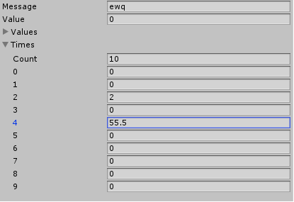

ver:2.0

### TypeDrawer 是什么?

它是一套类型绘制系统,类似于Unity的`SerializedObject`,但是它支持任何类型

### 如何使用它?

使用它很简单和Unity的`SerializedObject`一样的方式.

```

class Test
{
	string Message;
	int Value;
	int[] Values;
	List<float> Times;
}

Test _test = new Test();

TypeDrawObject drawObject = new TypeDrawObject(_test);;

TypeDraw.DrawType("",drawObject);

```

