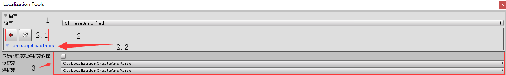
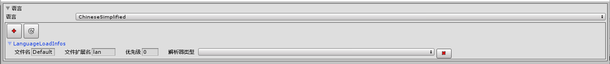

在Config Tools和Localization Tools种都会看到这样的ui,它们都是干嘛的,将在下面进行说明.

###### LanguageSeting
1. 窗口的语言选择区
- 这里可以选择窗口的语言,只能选择以加载的语言
2. 窗口语言的语言信息区(类似变体)
> 1. 语言信息功能区
>> 1. 添加一条语言信息,会在LanguageLoadInfos中显示
>> 2. 应用语言信息
> 2. 语言信息区,当添加了语言信息,可以在这里修改语言信息

###### CreatAndParseSelect
3. 配置创建器/解析器选择区
> 1. 开启后选择了创建器或解析器后会同步对方的选择,前提是双方数量一致
