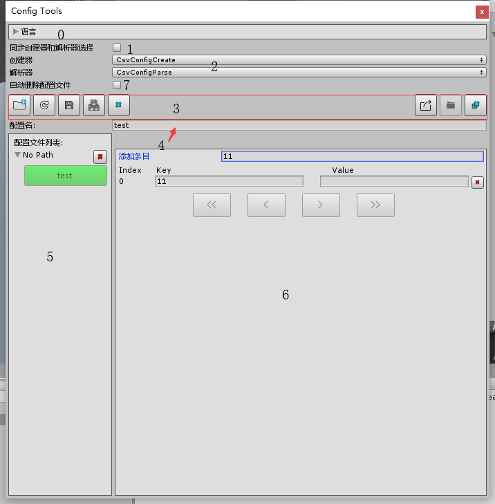

#### 菜单路径在`Icarus/EditorFrame/Config/Config Editor`

0. ###### 请看[需知](0.需知.md#LanguageSeting)
1. ###### 请看[需知](0.需知.md#CreatAndParseSelect)
2. ###### 请看[需知](0.需知.md#CreatAndParseSelect)
3. 功能区,从左到右说明
> 1. 增加目录,点击后打开一个目录选择,选择目录后会扫描目录下当前选择创建器创建器文件
> 2. 刷新文件(重新读取的意思),注意未保存为文件的会被删除
> 3. 保存当前编辑的配置(只有在选择了配置后才可用)
> 4. 保存全部配置(只有当存在配置时才可用)
> 5. 删除配置,如果勾选了[删除配置时同时也删除本地文件](#删除配置时同时也删除本地文件)则会删除本地文件,同时图标也会改变为红色,否则只从编辑器中删除
> 6. 导出所有配置(只有当存在语言配置时才可用)
> 7. 打开当前编辑配置的所在目录(只有在选择了配置后才可用)
> 8. 删除所有配置,如果勾选了[删除配置时同时也删除本地文件](#删除配置时同时也删除本地文件)则会删除本地文件,否则只从编辑器中删除

4. 配置名,回车创建配置,如果配置名已存在就不会创建
5. 配置列表区
6. 配置操作区
7. ###### 删除配置时同时也删除本地文件
- 开启后删除配置时同时也会删除本地文件