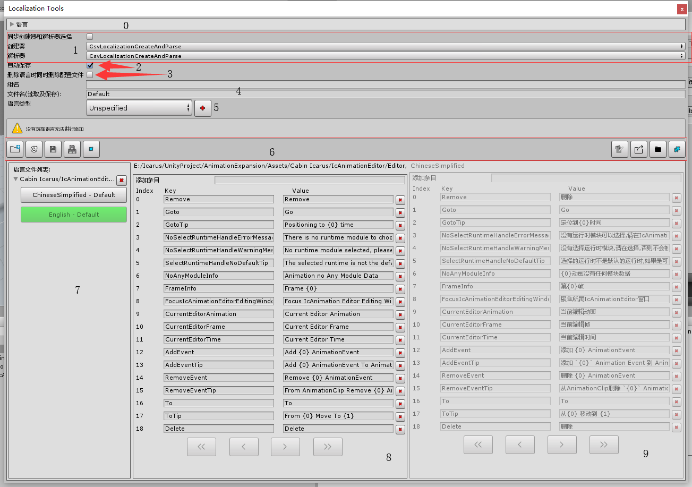

菜单在 `Icarus/EditorFrame/Localization/Localization Editor`



0. 请看[需知](0.需知.md#LanguageSeting)
1. 请看[需知](0.需知.md#CreatAndParseSelect)
2. 编辑器失去焦点后自动保存所有语言配置
3. ###### 删除语言时同时删除本地文件
- 开启后删除配置时同时也会删除本地文件
4. 语言配置创建区,当没有选择任何语言配置时组名不能为空,如果选择了配置,没有输入组名,则会创建在当前选择的配置组中,如果即选择了配置又输入了组名,则会创建在输入名字的组
5. 需要创建的语言,有50种语言可以选择
6. 功能区,从左到右说明:
> 1. 增加目录,点击后打开一个目录选择,选择目录后会扫描目录下当前选择创建器创建器文件
> 2. 刷新文件(重新读取的意思),注意未保存为文件的会被删除
> 3. 保存当前编辑的语言配置的组(只有在选择了语言配置后才可用)
> 4. 保存全部配置(只有当存在语言配置时才可用)
> 5. 删除配置,如果勾选了[删除语言时同时删除本地文件](#删除语言时同时删除本地文件)则会删除本地文件,同时图标也会改变为红色,否则只从编辑器中删除
> 6. 导出当前编辑的语言配置的组(只有在选择了语言配置后才可用)
> 7. 导出所有语言配置(只有当存在语言配置时才可用)
> 8. 打开当前编辑配置的所在目录(只有在选择了语言配置后才可用)
> 9. 删除所有配置,如果勾选了[删除语言时同时删除本地文件](#删除语言时同时删除本地文件)则会删除本地文件,同时图标也会改变为红色,否则只从编辑器中删除

7. 语言配置列表区
8. 语言配置操作区
9. 语言对比区

### 2019.0.4.1 版本

在之前版本不支持语言key嵌入,从该版本开始支持语言key嵌入格式为`{keyName}`可以和`string.Format`共存.

> 但是需要注意一点就是被嵌入得语言如果存在`Format`参数,那该语言文本的`Format`参数从被嵌入的语言`Format`参数索引下一个开始,如:

```

editorFrame Unity编辑器框架,Version:{0}

test Hello {editorFrame},Unity Version:{1}

#string.Format(GetValue("test"),EditorFrame.Version,Application.unityVersion) -> Hello Unity编辑器框架,Version:2019.0.4.1,Unity Version:2018.3.13f1

```