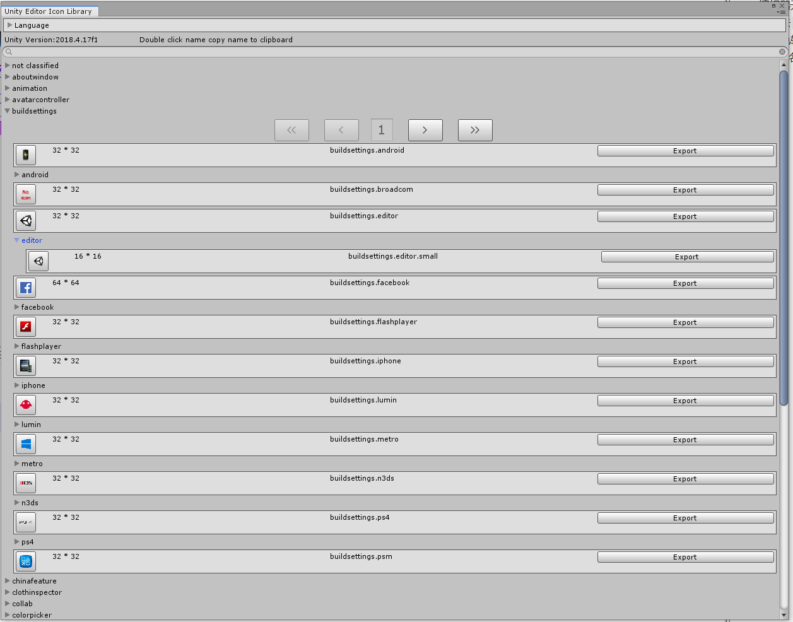

### 它是什么?

编辑器开发时我们总不能快速的知道Unity内置Icon的名字,我在写它之前总是去[`Unity Icon`](https://unitylist.com/p/5c3/Unity-editor-icons)中查看,但是因为图标很多加载比较慢,同时版本更新也较慢.但是它时跟随你unity版本的,所以不需要担心版本不同而导致icon名字变了或不存在等问题

### 它的功能

1.图标的多层分类及分页管理

2.搜索图标

3.复制图标名字,双击图标名复制

4.导出图标

